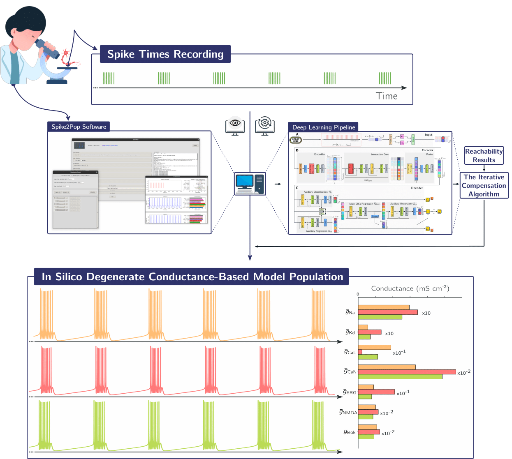

# Master Thesis – Automatic Generation of Degenerate Conductance-Based Neuron Models

Deep learning pipeline for generating degenerate conductance-based neuron models from spike times using Dynamic Input Conductances (DICs). This repository contains the codebase developed as part of my master's thesis in biomedical engineering.

## 🧠 Motivation

Understanding how the brain maintains stable function through diverse biophysical configurations — neuronal degeneracy — is a central challenge in neuroscience. Experimentalists often lack tools to relate recorded spike trains to the full set of plausible underlying conductance-based models (CBMs).

This work introduces a solution that bridges that gap using a novel deep learning architecture and the theory of Dynamic Input Conductances (DICs) to map spike time data to multiple valid neuronal parameter configurations.

## 🎯 Objectives

1. Create a pipeline to generate degenerate populations of CBMs that reproduce specific neuronal activities.

2. Enable experimental neuroscientists to generate models without deep expertise in machine learning or numerical modeling.

3. Provide a user-friendly open-source software interface to make CBM analysis accessible and practical in lab settings.

## Summary of Research Contributions

**Research Question**

The central research question addressed in this thesis is: "*How can we generate degenerate populations of conductance-based models (CBMs) with a target activity using only recordings of spike times?*" This question is motivated by the need to bridge the gap between experimental data, the reality of experimentalists' work, and computational modeling, facilitating the study of neuronal degeneracy.

**Main Contributions**

This work introduces several key contributions to the field of computational neuroscience:
- **Pipeline Development:** Development of a robust pipeline that combines the theory of Dynamic Input Conductances (DICs) with a deep learning architecture to generate degenerate CBM populations. This pipeline is validated using synthetic data and is adaptable to different CBMs.
- **Iterative Compensation Algorithm:** Improvement of existing methods for generating degenerate populations by introducing an iterative compensation algorithm. This algorithm enhances the precision of targeting specific DIC values with minimal computational overhead.
- **Open-Source Software:** Creation of an open-source software package that provides a user-friendly interface for experimentalists to generate and validate CBM populations. This software does not require expertise in deep learning or programming.
- **Theoretical Insights:** Exploration of reachability in the DICs space, providing a heuristic for selecting conductances to compensate during population generation. This contributes to the theoretical understanding of neuronal activity and degeneracy.

<em>Figure: Pipeline for generating degenerate conductance-based models from neuronal spike times recording.</em>

These contributions not only advance our understanding of neuronal degeneracy but also provide practical tools for experimentalists, fostering interdisciplinary collaboration and innovation in neurosciences research.

## Related repository
The Spike2Pop application can be found in its own reposotiry : [https://github.com/julienbrandoit/Spike2Pop---Bridging-Experimental-Neuroscience-and-Computational-Modeling](https://github.com/julienbrandoit/Spike2Pop---Bridging-Experimental-Neuroscience-and-Computational-Modeling)

## Structure of the repository

They are two main directories in this repository:
- '[FIGURES_GENERATION](FIGURES_GENERATION)' contains the code to generate the figures of the thesis.

In this folder, you will find roughly one subfolder per chapter of the thesis. Figures are generated in jupyter notebooks, and there is roughly one notebook per section of the chapter. Each folder contains a 'figures' subfolder where the generated figures are saved. We distinguish between:
1. the raw figures generated by the code, which are saved directly in the 'figures' subfolder,
2. the final figures, which are saved in the 'figures/final' subfolder in a pdf format.
3. the figures have been edited in Inkscape by myself, the svg files are saved in the 'figures/composing' subfolder. 

- '[MAIN_CODE](MAIN_CODE)' contains the main code of the thesis, including the pipeline to generate degenerate populations of conductance-based models.

In this folder there are also a lot of 'temp' folders, that saved things that are not used in the final code, but that were useful during the development of the code. They are not cleaned up to keep a trace of the development process and because they can be useful in the future.

I also provide the 'slurm' launch scripts to run the code on a cluster.

In practice, they are a lot of duplicated files between these two directories because it makes it easier to run the code for the figures generation.

This repository is not a clean and polished codebase, it is a collection of scripts that I used to generate the figures of my thesis. For a more polished and user-friendly codebase, please refer to the Spike2Pop repository (sources folder).

## Contact

For questions, feedback, or collaboration inquiries, feel free to contact me:

**BRANDOIT Julien**  
📧 [julienbrandoit@gmail.com](mailto:julienbrandoit@gmail.com)
