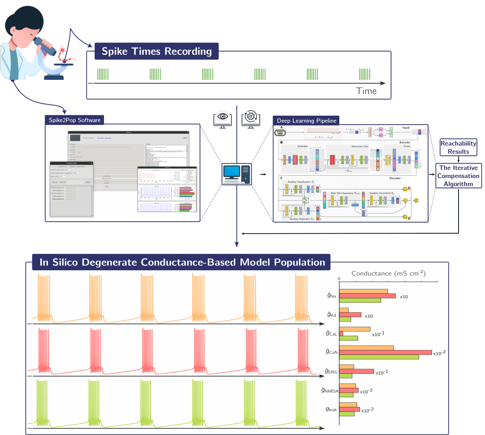

# A Deep Learning Method for Fast Generation of Degenerate High-Dimensional Conductance-Based Populations from Neuronal Spike Times

Deep learning pipeline for generating degenerate conductance-based neuron models from spike times using Dynamic Input Conductances (DICs).

## 🧠 Motivation

Understanding how the brain maintains stable function through diverse biophysical configurations — neuronal degeneracy — is a central challenge in neuroscience. Experimentalists often lack tools to relate recorded spike trains to the full set of plausible underlying conductance-based models (CBMs).

This work introduces a solution that bridges that gap using a novel deep learning architecture and the theory of Dynamic Input Conductances (DICs) to map spike time data to multiple valid neuronal parameter configurations.

## 🎯 Objectives

1. Create a pipeline to generate degenerate populations of CBMs that reproduce specific neuronal activities.
2. Enable experimental neuroscientists to generate models without deep expertise in machine learning or numerical modeling.
3. Provide a user-friendly open-source software interface to make CBM analysis accessible and practical in lab settings.

## Summary of Research Contributions

**Research Question**

The central research question addressed in this work is:  
"*How can we generate degenerate populations of conductance-based models (CBMs) with a target activity using only recordings of spike times?*"  
This question is motivated by the need to bridge the gap between experimental data, the reality of experimentalists' work, and computational modeling, facilitating the study of neuronal degeneracy.

**Main Contributions**

This work introduces several key contributions to the field of computational neuroscience:
- **Pipeline Development:** Development of a robust pipeline that combines the theory of Dynamic Input Conductances (DICs) with a deep learning architecture to generate degenerate CBM populations. This pipeline is validated using synthetic data and is adaptable to different CBMs.
- **Iterative Compensation Algorithm:** Improvement of existing methods for generating degenerate populations by introducing an iterative compensation algorithm. This algorithm enhances the precision of targeting specific DIC values with minimal computational overhead.
- **Open-Source Software:** Creation of an open-source software package that provides a user-friendly interface for experimentalists to generate and validate CBM populations. This software does not require expertise in deep learning or programming.
- **Theoretical Insights:** Exploration of reachability in the DICs space, providing a heuristic for selecting conductances to compensate during population generation. This contributes to the theoretical understanding of neuronal activity and degeneracy.

  

<em>Figure: Pipeline for generating degenerate conductance-based models from neuronal spike times recording.</em>

These contributions not only advance our understanding of neuronal degeneracy but also provide practical tools for experimentalists, fostering interdisciplinary collaboration and innovation in neuroscience research.

## Related repository
The Spike2Pop application can be found in its own repository: [https://github.com/julienbrandoit/Spike2Pop---Bridging-Experimental-Neuroscience-and-Computational-Modeling](https://github.com/julienbrandoit/Spike2Pop---Bridging-Experimental-Neuroscience-and-Computational-Modeling)

## Structure of the repository

There are two main directories in this repository:
- **[FIGURES_GENERATION](FIGURES_GENERATION)** contains the code to generate the figures presented in the paper.  
  - This folder includes one subfolder per section, with Jupyter notebooks to generate raw figures (saved in `figures`), final versions (saved in `figures/final` as PDFs), and editable versions (saved in `figures/composing` as SVGs created in Inkscape).

- **[MAIN_CODE](MAIN_CODE)** contains the main codebase, including the pipeline to generate degenerate populations of conductance-based models.  
  - This folder also includes various `temp` directories, which contain intermediate files kept to preserve the development history and for potential future use.

`slurm` launch scripts are also provided to run the code on a cluster.  
Note that there is some duplication between the two main directories to simplify figure generation and code execution.

This repository is intended as a working research codebase. For a more polished and user-friendly implementation, please refer to the Spike2Pop repository (sources folder).

## Contact

For questions, feedback, or collaboration inquiries, feel free to contact:

**BRANDOIT Julien**  
📧 [julienbrandoit@gmail.com](mailto:julienbrandoit@gmail.com)
